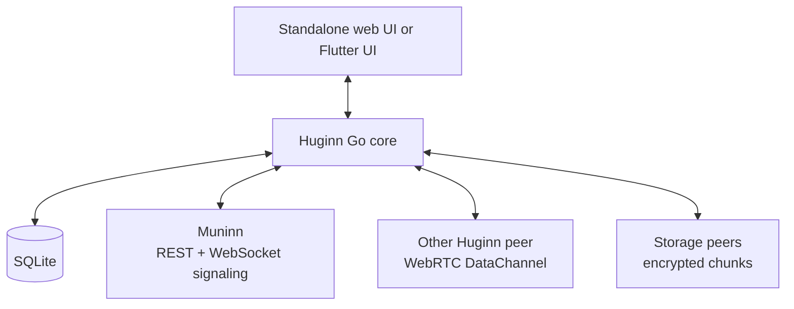

# Huginn Messenger — Go core

Go-ядро P2P-мессенджера Huginn. Проект можно запустить как самостоятельное
desktop-приложение с локальным web UI либо собрать как shared library для
Flutter-клиента из родительского репозитория.

Muninn используется как directory/signaling service и реестр метаданных
офлайн-чанков. Текст и файлы передаются между Huginn-пирами по WebRTC и не
хранятся в Muninn.

## Возможности

- E2E-шифрование: X25519, AES-256-GCM и Ed25519;
- прямые P2P-соединения через WebRTC DataChannel;
- WebSocket-сигналинг через Muninn с optional HTTP polling fallback;
- резервная и офлайн-доставка зашифрованными чанками через storage-пиры;
- личные и групповые чаты;
- передача файлов и фоновое восстановление вложений;
- локальное SQLite-хранилище;
- relogin с переносом идентичности, истории, контактов и групп;
- локальный web UI с Server-Sent Events;
- C ABI для Flutter/Dart FFI.

## Архитектура



Подробные последовательности и фоновые процессы описаны в
[`docs/architecture.md`](docs/architecture.md). Архитектура Flutter-оболочки
описана в [`../../docs/flutter-application.md`](../../docs/flutter-application.md).

## Требования

- Go 1.25 или новее;
- запущенный Muninn;
- доступные UDP/TCP-маршруты для WebRTC либо настроенный TURN.

## Запуск standalone-приложения

Сначала запустите Muninn из соседнего репозитория:

```bash
cd /path/to/muninn
go run .
```

Затем соберите и запустите два экземпляра Huginn с разными базами и UI-портами:

```bash
cd /path/to/huginn-messenger
go build -o huginn-messenger .

# Alice
./huginn-messenger \
  --username alice \
  --muninn http://localhost:8080 \
  --db alice.db \
  --ui-port 8081

# Bob
./huginn-messenger \
  --username bob \
  --muninn http://localhost:8080 \
  --db bob.db \
  --ui-port 8082
```

Откройте `http://localhost:8081` и `http://localhost:8082`.

Если `--ui-port=0`, HTTP-сервер и web UI не запускаются. При пустом username
создаётся временное UUID-имя.

### Флаги

| Флаг | Значение по умолчанию | Назначение |
|---|---|---|
| `--username` | UUID при пустом значении | Login пользователя |
| `--muninn` | `https://muninn.evil-bread.ru` | Адрес Muninn |
| `--ui-port` | `0` | Порт web UI; `0` выключает сервер |
| `--db` | `huginn.db` | Путь к SQLite |
| `--chunk-ttl` | `1w` | TTL чанков: `1d`, `1w` или `1m` |
| `--peer-flag` | `thin` | Класс storage-пира: `thin`, `thick`, `very_thick` |

Конфигурация также читается из `config.conf`. TURN-поля называются
`turn_addr`, `turn_user` и `turn_pass`.

## Как доставляются сообщения

### Сигналинг

Клиент подключается к `ws://<muninn>/api/v1/ws?peer_id=<id>` либо к `wss://`
для HTTPS. Через JSON-RPC-подобные сообщения `connect_to_peer` и
`signal_relay` передаются SDP offer/answer. При `messenger.WithPoll()` доступен
HTTP fallback через:

- `POST /api/v1/peers/{id}/signals`;
- `GET /api/v1/peers/{id}/signals` с polling каждые 500 мс.

Обычный standalone/FFI startup не включает `WithPoll`: если WebSocket временно
недоступен, исходящий сигнал можно поставить через HTTP, но target получит его
после восстановления WebSocket-соединения.

После согласования соединения Muninn больше не участвует в передаче payload.

### Онлайн-доставка

Для текстового сообщения ядро до пяти секунд ожидает открытый WebRTC
DataChannel. После прямой отправки оно также создаёт офлайн-представление
сообщения как резервный путь доставки. Исходящее сообщение сразу сохраняется в
локальной SQLite.

### Офлайн-доставка и файлы

Payload разбивается на части по 1024 байта. Каждая часть шифруется и
подписывается, сохраняется локально, регистрируется в Muninn и по возможности
реплицируется на quality-ranked storage-пиры. Получатель запрашивает метаданные:

```text
GET /api/v1/recipient/chunks?recipient_id=<key>&date_from=<unix>
```

Данные чанков забираются непосредственно у Huginn-пиров по WebRTC. После
проверки хэшей и подписей сообщение восстанавливается и сохраняется в SQLite.

## Web UI и real-time события

Standalone web UI вызывает локальные HTTP endpoints из `internal/ui/server.go`.
Списки пиров и новые сообщения обновляются через `GET /api/events` (SSE).

Flutter-клиент не использует этот HTTP API и SSE. Он вызывает функции из
`bridge.go` через Dart FFI и получает события `peers`, `message` и `file_ready`
через `messenger_get_event`.

## Структура проекта

```text
main.go                         standalone entry point
bridge.go                       exported C ABI and Flutter event queue
internal/config/                CLI and persisted configuration
internal/crypto/                encryption, key exchange and signatures
internal/chunk/                 1 KiB chunk envelopes and reassembly
internal/webrtc/                P2P WebRTC manager and DataChannel protocol
internal/muninn/                Muninn REST and WebSocket clients
internal/messenger/             delivery, groups, files and relogin
internal/store/                 SQLite store and migrations
internal/ui/                    standalone HTTP API, SSE and embedded web UI
docs/architecture.md            detailed protocol diagrams
```

## Shared library для Flutter

```bash
make library
```

Результат находится в `dist/linux_<arch>/`. `make package-library` дополнительно
создаёт версионированный архив с `.so`, C-заголовком и `SHA256SUMS`.

Контрактом служат экспортированные функции в `bridge.go`. При его изменении
нужно синхронно обновить C-заголовок и Dart FFI-обёртку родительского
Flutter-проекта.

### Публикация версии

Версия библиотеки хранится в `VERSION`. Push тега с тем же значением запускает
GitHub Actions, который собирает glibc-библиотеки для `linux/amd64` и
`linux/arm64` и публикует их вместе с `SHA256SUMS` в GitHub Release:

```bash
git tag v0.1.0
git push origin v0.1.0
```

Перед следующим выпуском сначала измените `VERSION`. Обычные push и pull request
тоже собирают оба библиотечных артефакта, но не публикуют release.

## Тесты

```bash
GOCACHE=/tmp/huginmunin-messenger-go-cache go test ./...
```

Интеграционные тесты используют локальные HTTP/WebSocket listeners, поэтому
среда запуска должна разрешать loopback-соединения.
