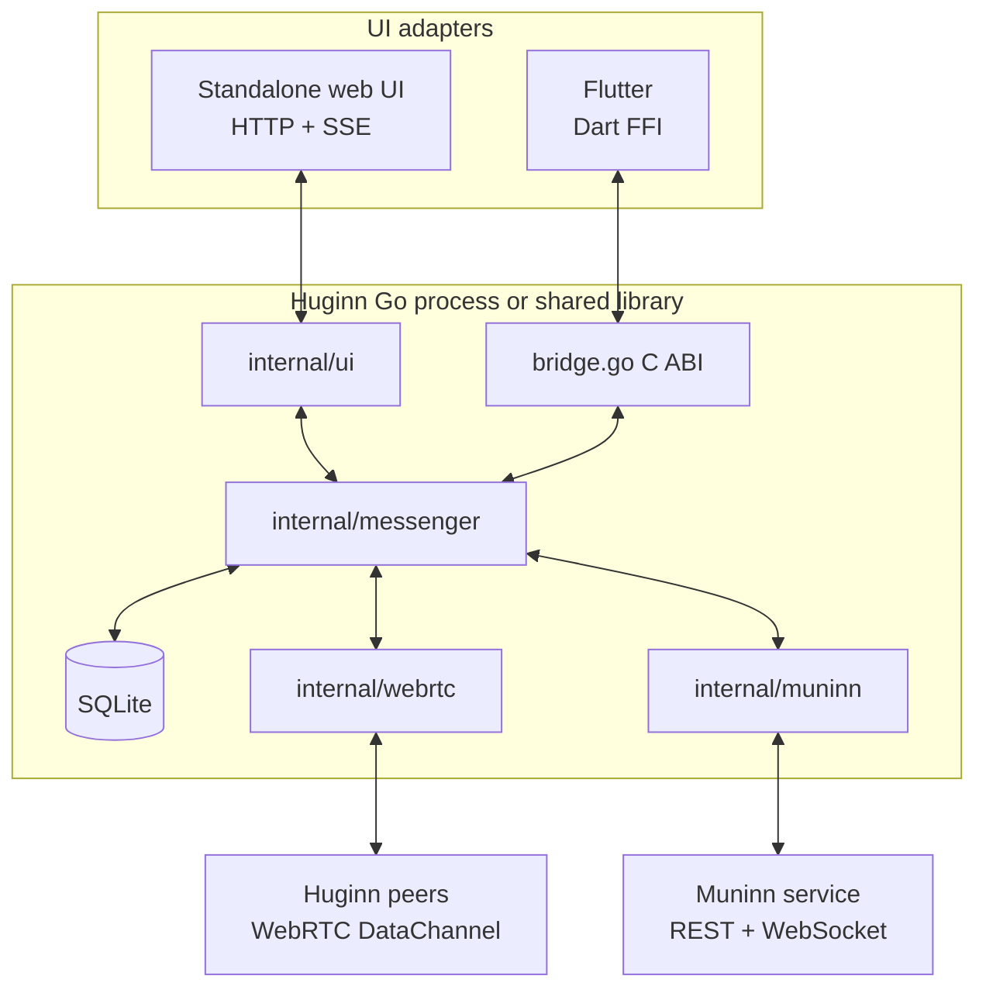
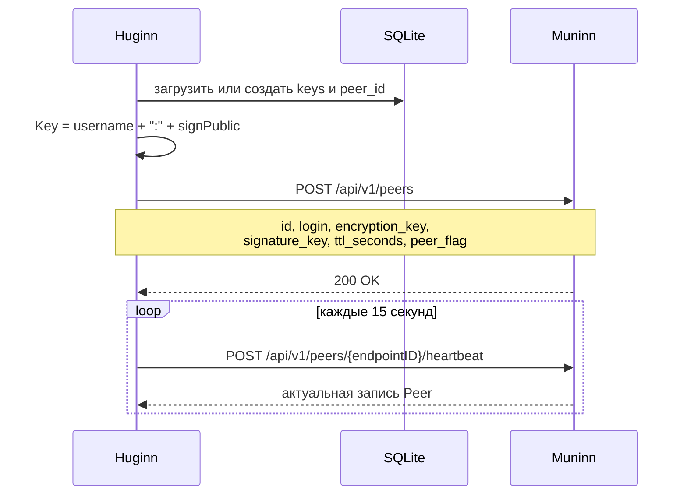
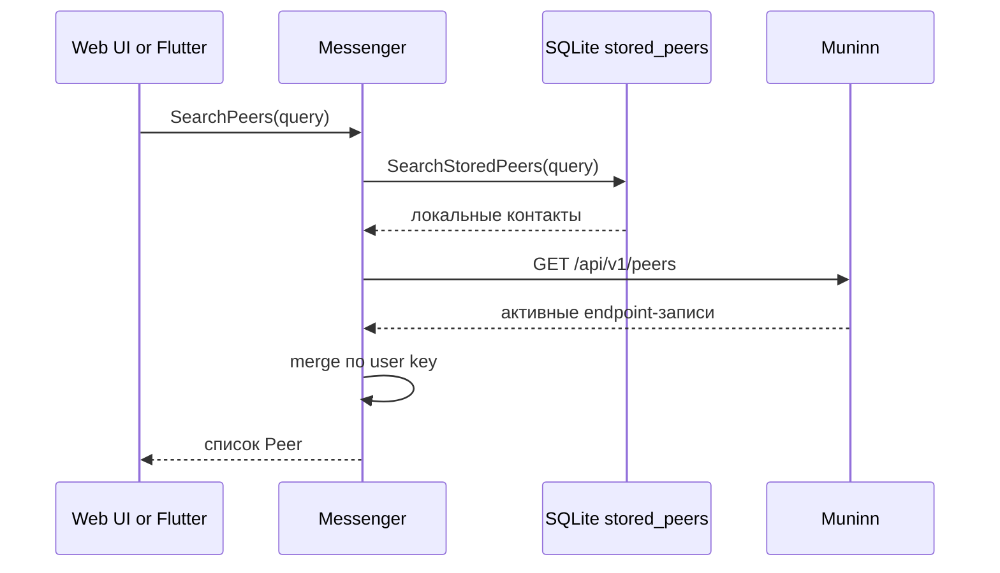
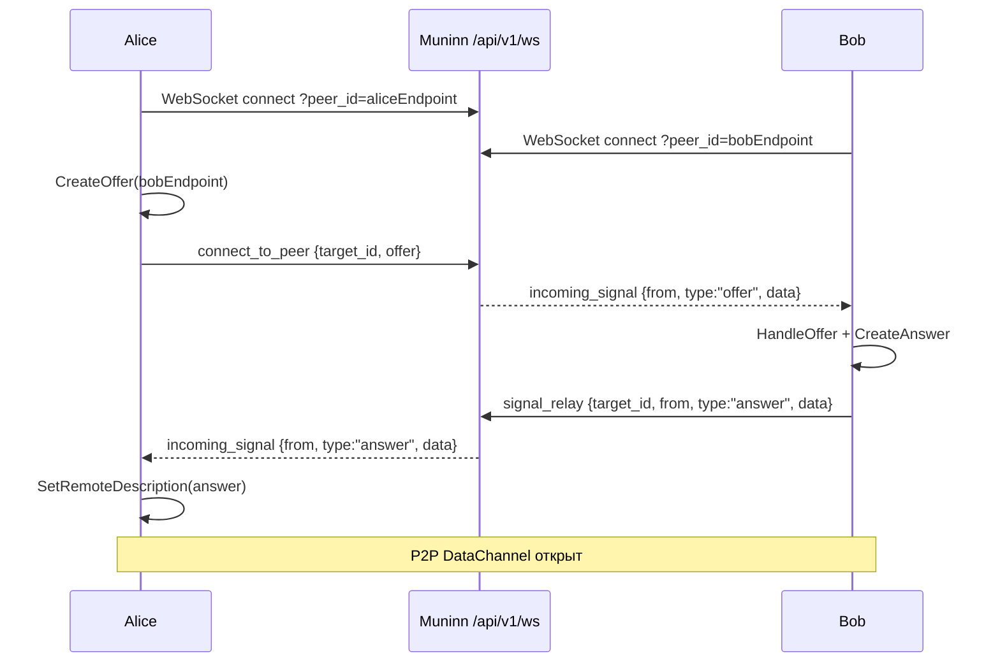
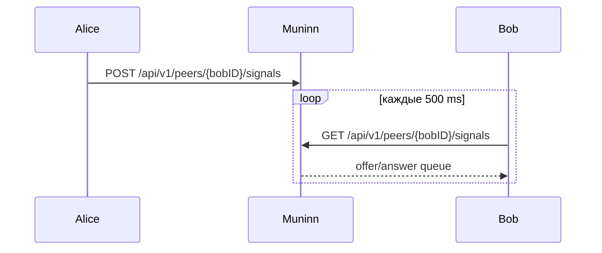
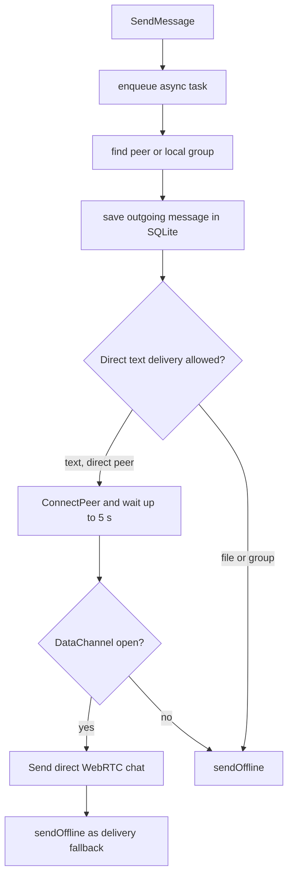
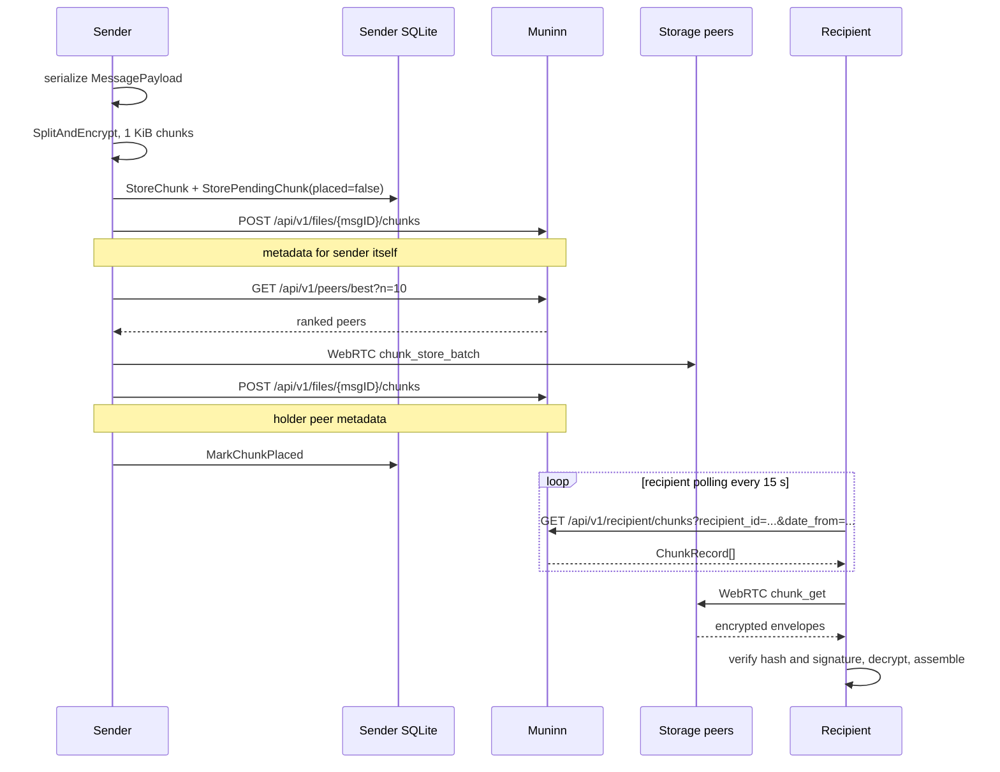
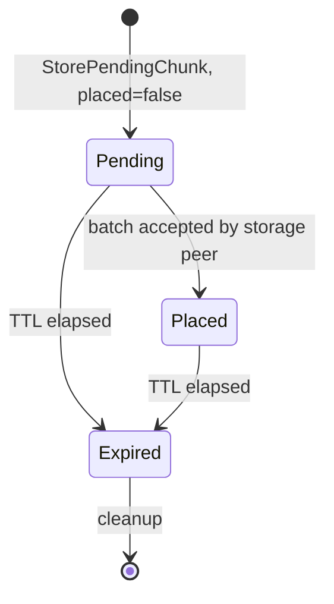
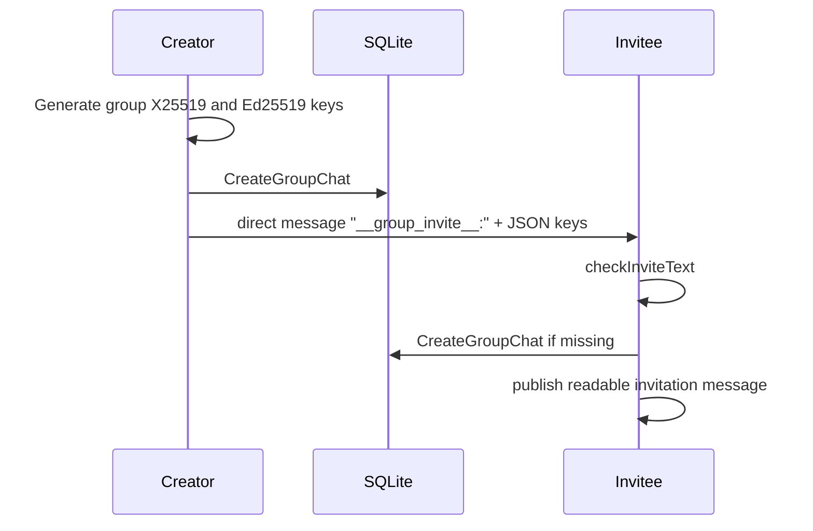
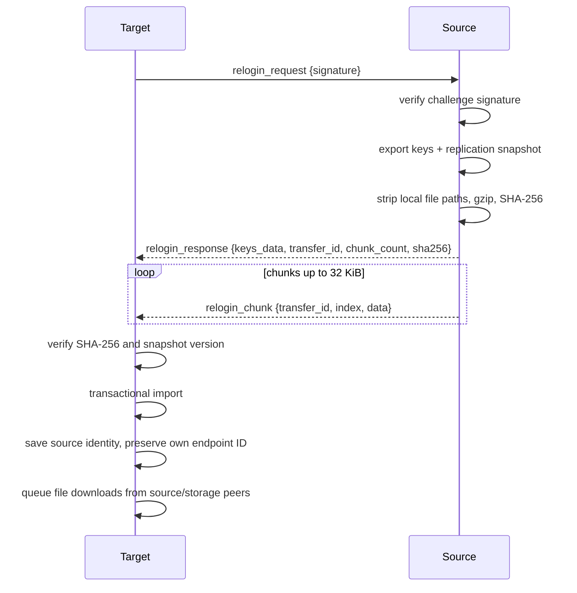

# Huginn Messenger — архитектура Go-ядра

Документ описывает текущую реализацию Go-приложения и native-ядра Huginn.
Standalone web UI и Flutter — два разных адаптера одного `Messenger`:

- standalone-процесс запускается через `main.go` и поднимает локальный HTTP API;
- Flutter загружает shared library и вызывает экспортированный C ABI из
  `bridge.go`.

Muninn хранит directory-записи, сигналы и метаданные чанков. Открытый текст и
содержимое файлов в Muninn не отправляются.

## 1. Компоненты



Основные каталоги:

| Каталог | Назначение |
|---|---|
| `internal/messenger` | Жизненный цикл, доставка, группы, файлы и relogin |
| `internal/muninn` | REST-клиент и signaling WebSocket-клиент |
| `internal/webrtc` | P2P PeerConnection и DataChannel protocol |
| `internal/chunk` | Разбиение, шифрование, подпись и сборка чанков |
| `internal/store` | SQLite, миграции и локальные снимки |
| `internal/ui` | Standalone HTTP API, embedded web UI и SSE |
| `bridge.go` | Экспортированный C ABI и очередь событий для Flutter |

## 2. Идентичность, регистрация и heartbeat

Устройство имеет два связанных идентификатора:

- `Messenger.ID` — UUID конкретного WebRTC endpoint;
- `Messenger.Key` — пользовательский ключ `login:signature_public_key`.

Несколько устройств после relogin могут иметь один пользовательский ключ, но
разные endpoint ID.



Первичная регистрация использует TTL 120 секунд. Текущая реализация heartbeat
передаёт `ttl_seconds=15`; Muninn обновляет `last_seen` и принимает переданный
TTL. Если Muninn отвечает `peer not found`, клиент повторяет полную регистрацию.

## 3. Поиск пиров



Локальные контакты позволяют показывать ранее известных пользователей, даже
если они сейчас недоступны. Активные записи Muninn обновляют endpoint ID, ключи,
`last_seen` и TTL. Собственный пользовательский ключ исключается из результата.

## 4. Сигналинг WebRTC

Muninn не является WebRTC peer. Основной signaling transport между Huginn и
Muninn — обычный WebSocket.

### 4.1. WebSocket — основной путь



WebSocket URL строится из адреса Muninn:

```text
http  -> ws://host/api/v1/ws?peer_id=<endpointID>
https -> wss://host/api/v1/ws?peer_id=<endpointID>
```

Клиент пытается восстановить WebSocket каждые пять секунд. Muninn держит map
активных соединений по endpoint ID. Если target не подключён, сигнал сохраняется
в Store и будет доставлен при следующем WebSocket connect или HTTP polling.

### 4.2. HTTP polling — fallback



Polling включается опцией `WithPoll`. Даже без него цикл каждые 500 мс
обрабатывает сигналы, уже доставленные из WebSocket callback в локальный канал.

### 4.3. RPC-формат

Все signaling-сообщения сейчас являются JSON text frames.

Request:

```json
{"id":"uuid","method":"connect_to_peer","params":{"target_id":"bob","offer":"..."}}
```

Response:

```json
{"id":"uuid","result":{},"error":""}
```

Notification:

```json
{"method":"incoming_signal","params":{"from":"alice","type":"offer","data":"..."}}
```

Поддерживаемые методы:

| Метод | Направление | Назначение |
|---|---|---|
| `connect_to_peer` | client → Muninn | Передать начальный offer |
| `signal_relay` | client → Muninn | Передать offer/answer целевому endpoint |
| `incoming_signal` | Muninn → client | Push входящего сигнала |

## 5. Отправка сообщения

Публичный `Messenger.SendMessage` не ждёт завершения доставки: задача помещается
в bounded worker pool из восьми workers и очереди на 128 задач. Синхронный
вариант `SendMessageSync` используется там, где вызывающей стороне нужен итог
выполнения.



Прямая WebRTC-структура содержит текст, UTC timestamp и `msg_id`, но не
метаданные файлов. Поэтому сообщения с файлами всегда проходят через chunk
delivery. Входящие прямые сообщения сохраняются в SQLite и публикуются
подписчикам ядра.

## 6. Офлайн-доставка чанками

`chunk.ChunkSize` равен 1024 байтам. Каждый envelope шифруется с помощью
X25519/AES-256-GCM и подписывается Ed25519.



Muninn хранит только `ChunkRecord`: file ID, index, sender/recipient keys,
expected hash, holder endpoint, флаги, timestamps и TTL. Фактические байты
остаются в SQLite Huginn-пиров.

Подпись манифеста строится по payload:

```text
muninn/expected/v1
{file_id}
{chunk_index}
{normalized_hash}
```

Storage-пир перед сохранением может отправить подписанный отчёт о полученном
чанке. Muninn проверяет отчёт и обновляет quality score source peer.

## 7. Получение и восстановление

Клиент опрашивает один endpoint для личного пользовательского ключа и по одному
ключу `groupUID:groupSignPublic` для каждой локальной группы:

```text
GET /api/v1/recipient/chunks?recipient_id=<key>&date_from=<unix>
```

Записи группируются по `file_id`. Для каждого уникального индекса ядро сначала
проверяет локальный SQLite, затем запрашивает holder peer по WebRTC. После
получения полного набора проверяются registered hash и подпись отправителя,
payload расшифровывается и сохраняется как `ChatMessage`.

`date_from` основан на локальном `last_chunk_check`, но клиент передаёт
`lastCheck-1`, чтобы не потерять записи с одинаковым Unix timestamp.

Mark-as-read является отдельной операцией:

```text
POST /api/v1/chunks/read
payload = "muninn/read/v1\n{file_id}"
```

## 8. Pending chunks и TTL



`pendingChunkLoop` каждые десять секунд выбирает неразмещённые чанки, группирует
их по recipient key, подключается к quality-ranked пирам и отправляет batch.
Pending-записи не повторяются бесконечно: `chunkCleanupLoop` удаляет истёкшие
чанки и pending records в соответствии с TTL.

## 9. Фоновые процессы

| Процесс | Интервал | Работа |
|---|---:|---|
| `heartbeatLoop` | 15 s | Heartbeat endpoint и повторная регистрация при 404 |
| `peerRefreshLoop` | 15 s | Репликация локальных чанков и поиск входящих сообщений |
| `signalPollLoop` | 500 ms | HTTP fallback и обработка WebSocket signals |
| `rtcReconnectLoop` | 5 s | Восстановление signaling WebSocket |
| `pendingChunkLoop` | 10 s | Размещение `placed=false` чанков |
| `fileDownloadLoop` | 15 s | Повторная загрузка ожидающих файлов |
| `chunkCleanupLoop` | 5 min | Очистка истёкших, завершённых и failed chunks |

Все циклы завершаются через общий `context.Context`. При shutdown ядро отменяет
context, закрывает signaling и WebRTC, ждёт background goroutines и worker pool,
после чего закрывает SQLite.

## 10. UI adapters и события

### 10.1. Standalone web UI

Web UI запускается только при ненулевом `--ui-port`. Актуальные local endpoints
определены в `internal/ui/server.go`:

| Метод | Путь | Назначение |
|---|---|---|
| `GET` | `/api/me` | Текущий пользователь |
| `GET` | `/api/peers` | Известные пиры |
| `GET` | `/api/peers/search?q=` | Поиск |
| `GET` | `/api/messages/{peer}` | История |
| `POST` | `/api/send` | Текстовое сообщение |
| `POST` | `/api/send-file` | Файл |
| `GET` | `/api/events` | SSE `peers` и `message` |
| `GET`, `POST` | `/api/config` | Конфигурация |
| `GET`, `POST` | `/api/groups` | Список и создание групп |
| `POST` | `/api/groups/{uid}/invite` | Приглашение |
| `POST` | `/api/groups/{uid}/send` | Сообщение группе |
| `POST` | `/api/groups/{uid}/send-file` | Файл группе |

SSE держит постоянное соединение и отправляет keepalive каждые десять секунд.

### 10.2. Flutter C ABI

`bridge.go` хранит native-инстансы по числовому handle. Сложные ответы
возвращаются JSON-строками; вызывающая сторона освобождает их через
`messenger_free_string`.

Основные группы экспортов:

| Операция | C ABI |
|---|---|
| Lifecycle | `messenger_create`, `messenger_destroy` |
| Identity/config | `messenger_get_me`, `messenger_get_config`, `messenger_save_config` |
| Peers/history | `messenger_get_peers`, `messenger_search_peers`, `messenger_get_messages_paginated` |
| Send | `messenger_send_message`, `messenger_send_file` |
| Groups | `messenger_create_group`, `messenger_get_groups`, `messenger_invite_to_group` |
| Events | `messenger_get_event` |
| Read state | `messenger_mark_read` |
| Relogin | `messenger_generate_relogin_signature`, `messenger_apply_relogin_signature` |
| Files | `messenger_set_downloads_dir`, `messenger_get_downloads_dir`, `messenger_get_file_path` |

Go event loop подписывается на `peers`, `message` и `file_ready` и складывает
события в очередь ёмкостью 100. При переполнении новое событие отбрасывается.
Flutter восстанавливает полное состояние отдельными history/peer вызовами.

## 11. Групповые чаты

### 11.1. Модель

Группа хранится локально как:

```text
uid, name,
enc_private, enc_public,
sign_private, sign_public,
created_at
```

`uid` используется в UI как `chat_id`, а chunk recipient key имеет вид
`uid:sign_public`. Групповые ключи общие для участников.

### 11.2. Создание и приглашение



Invite payload содержит закрытые групповые ключи, но проходит через обычный
зашифрованный direct-message transport. Его нельзя логировать или передавать в
открытом виде.

### 11.3. Отправка и получение

Отдельной функции `SendGroupMessage` нет. UI вызывает обычный
`SendMessage(groupUID, ...)`; ядро находит группу в SQLite, подставляет её ключи
и использует chunk delivery. Файлы в группах поддерживаются тем же
`SendMessage(..., filePaths, ...)`.

Получатель опрашивает Muninn по `groupUID:signPublic`, расшифровывает envelope
групповым private key и сохраняет сообщение с `chat_id=groupUID`.

Отдельных `groupHeartbeatLoop` и `RegisterAsPeer` в текущей реализации нет.
Группа не является самостоятельным WebRTC endpoint.

## 12. Файлы

Файл сначала разбивается на 1 KiB chunks и шифруется случайным симметричным
ключом. `FileMeta` в сообщении содержит:

- `file_id`, hash и decryption key;
- количество чанков и имя;
- локальный путь только на устройстве, где файл уже существует;
- optional `source_peer_id` для фоновой загрузки после relogin.

Локальные пути удаляются из сетевого payload. После получения сообщения
`processReceivedFile` запрашивает недостающие части, восстанавливает файл в
downloads directory и публикует `file_ready`.

## 13. Relogin

Relogin переносит пользовательские ключи и согласованный снимок локального
состояния, сохраняя endpoint ID целевого устройства.

### 13.1. Авторизация

Формат ключа:

```text
sourceEndpointID:base64(32-byte challenge).base64(ed25519 signature)
```

Цель находит endpoint источника через Muninn и проверяет подпись его публичным
ключом. Источник повторно проверяет тот же challenge собственным публичным
ключом перед выдачей данных.
    participant U as User
    participant UI as Browser
    participant API as Go HTTP Server

    Note over U,API: Загрузка групп
    UI->>API: GET /api/groups
    API-->>UI: [{uid, name}, ...]
    UI->>UI: renderGroupList — группы в сайдбаре

    Note over U,API: Создание группы
    U->>UI: нажал "+" → ввод имени
    UI->>API: POST /api/groups/create {name}
    API-->>UI: {uid, name}
    UI->>UI: fetchGroups() → re-render

    Note over U,API: Приглашение
    U->>UI: выбрал группу → выбрал peer → "Invite"
    UI->>API: POST /api/groups/{uid}/invite {peer_id}
    API-->>UI: {status: "ok"}

    Note over U,API: Отправка сообщения
    U->>UI: выбрал группу → ввод текста
    UI->>API: POST /api/groups/{uid}/send {text}
    API-->>UI: {status: "ok"}
    Note over UI: сообщение приходит через SSE
    UI->>UI: если activeGroup == uid → appendMessage
```

UI отображает группы в отдельной секции сайдбара. При выборе группы открывается окно чата, идентичное DM, но с дополнительной кнопкой "Invite" для приглашения участников.

---

## 13. Relogin (перенос идентичности)

### 13.1. Назначение

Relogin копирует с одного устройства на другое идентичность и локальное состояние пользователя: ключи, историю сообщений, direct-контакты и групповые чаты. После relogin целевой пир получает те же ключи шифрования и подписи, что и пир-источник, и может выступать от его имени.

Локальные пути и содержимое файлов в снимок не входят. Для каждого вложения передаются только метаданные (`file_id`, hash, ключ расшифровки, число чанков, имя и peer ID исходного устройства). Целевое устройство сохраняет такой указатель и загружает чанки в фоне с исходного устройства или storage-пиров.

### 13.2. Репликация



Снимок версии 1 включает сообщения, direct contacts и группы. Физические файлы
не копируются внутри snapshot: передаются только безопасные metadata pointers,
а содержимое догружается асинхронно.

Одна операция relogin имеет timeout две минуты. DataChannel backpressure
ограничивает накопленный send buffer значением 512 KiB.

## 14. Сводка transport-протоколов

| Назначение | Transport | Формат |
|---|---|---|
| Регистрация, peers, chunk metadata | HTTP(S) Muninn | JSON |
| Основной signaling | WS(S) `/api/v1/ws` | JSON text frames |
| Fallback signaling | HTTP(S) signals endpoints | JSON |
| P2P text/chunks/files/relogin | WebRTC DataChannel | binary frame с JSON envelope/payload |
| Standalone live UI | local HTTP SSE | text/event-stream + JSON data |
| Flutter integration | in-process C ABI | UTF-8 JSON strings |

Маршруты Muninn всегда следует сверять с соседним
`muninn/internal/api/server.go`, а C ABI — с экспортами в `bridge.go`.
    participant A as Alice (source)
    participant B as Bob (target)
    participant M as Muninn

    Note over A: GenerateReloginSignature()
    A->>A: Generate 32-byte challenge
    A->>A: Sign challenge with Ed25519 private key
    Note over A: Output: "alice:base64(challenge).base64(sig)"

    Note over A: Copy signature (out-of-band)

    Note over B: ApplyReloginSignature(signature)
    B->>B: Parse "alice:base64(challenge).base64(sig)"
    B->>B: Verify signature with Alice's public key
    B->>B: If valid → connect to Alice via WebRTC
    B->>A: WebRTC connect + send relogin_request

    A->>A: Verify signature against own public key
    Note over A: Proves Alice herself created the challenge
    A->>A: Read keys.conf
    A->>A: Build SQLite snapshot
    A->>A: Remove local file paths, gzip + SHA-256
    A->>B: relogin_response {keys_data, transfer_id, chunk_count, sha256}
    loop Snapshot chunks
        A->>B: relogin_chunk {transfer_id, index, data}
    end

    B->>B: Verify SHA-256 and import snapshot transactionally
    B->>B: Write keys.conf (overwrite)
    B->>B: Queue file pointers for background download
    Note over B: Bob keeps its endpoint peer ID and now has Alice's identity/state
```

### 13.3. Формат подписи

```
peerID:base64(challenge).base64(signature)
```

- `peerID` — ID пира, к которому нужно подключиться (Alice)
- `challenge` — 32 случайных байта
- `signature` — Ed25519-подпись `challenge`, созданная приватным ключом Alice

### 13.4. Проверка подписи

При получении `relogin_request` сторона-источник (Alice) извлекает challenge из подписи и верифицирует его своим собственным публичным ключом:

```go
crypto.Verify(m.signPublic, challenge, sig) // true только если подпись создана m.signPrivate
```

Поскольку только Alice знает свой приватный ключ, только она могла создать данную подпись. Если подпись валидна — значит, Alice сама сгенерировала этот challenge, и Bob действует с её разрешения.

Сторона-цель (Bob) также верифицирует подпись перед подключением к Alice — это подтверждает, что signature была создана именно Alice.

### 13.5. Передача ключей и данных

После верификации подписи Alice читает `keys.conf`, строит согласованный снимок таблиц `messages`, `stored_peers` и `group_chats`, удаляет из сообщений локальные `file_path`, затем сжимает снимок gzip. Канал WebRTC уже защищён DTLS-шифрованием, дополнительное шифрование не требуется.

Сжатый снимок разбивается на сообщения размером не более 32 KiB. Bob собирает их по `transfer_id`, проверяет SHA-256 и импортирует снимок одной SQLite-транзакцией. Импорт идемпотентно объединяет записи по их первичным ключам и не удаляет локальные записи целевого устройства. Только после успешного импорта Bob сохраняет новые ключи и конфигурацию.

Физический `peer_id` Bob не заменяется на `peer_id` Alice: устройства остаются отдельными WebRTC endpoints с одной пользовательской криптографической идентичностью. Это также позволяет Bob после пересоздания Go-инстанса продолжить фоновую загрузку файлов непосредственно с Alice.

### 13.6. Протокол WebRTC

Типы сообщений relogin в `internal/webrtc/webrtc.go`:

| Тип | Направление | Структура |
|-----|-------------|-----------|
| `relogin_request` | Bob → Alice | `{signature: "alice:challenge.sig"}` |
| `relogin_response` | Alice → Bob | `{keys_data, transfer_id, chunk_count, sha256, error?}` |
| `relogin_chunk` | Alice → Bob | `{transfer_id, index, data}` |

### 13.7. C-bridge API

| Функция | Описание |
|---------|----------|
| `messenger_generate_relogin_signature` | Сгенерировать подпись: `() → {signature}` |
| `messenger_apply_relogin_signature` | Применить подпись: `(signature) → {status}` |

### 13.8. Важные замечания

- **Relogin не требует хранения состояния.** Alice не запоминает созданные challenge'и — верификация подписи доказывает, что она сама её создала.
- **После relogin старые ключи Bob'а теряются.** Если Bob не сохранил их отдельно, он не сможет восстановить свою старую идентичность.
- **Endpoint peer ID не меняется.** Relogin меняет пользовательский login и криптографические ключи, но сохраняет уникальный ID устройства.
- **После relogin Flutter пересоздаёт Go-инстанс.** Новый экземпляр регистрируется на Muninn с прежним endpoint `peer_id`, новым login/ключами и возобновляет фоновые загрузки по сохранённым файловым указателям.
