# Huginn Messenger — архитектура передачи сообщений

## 1. Регистрация пира и heartbeat

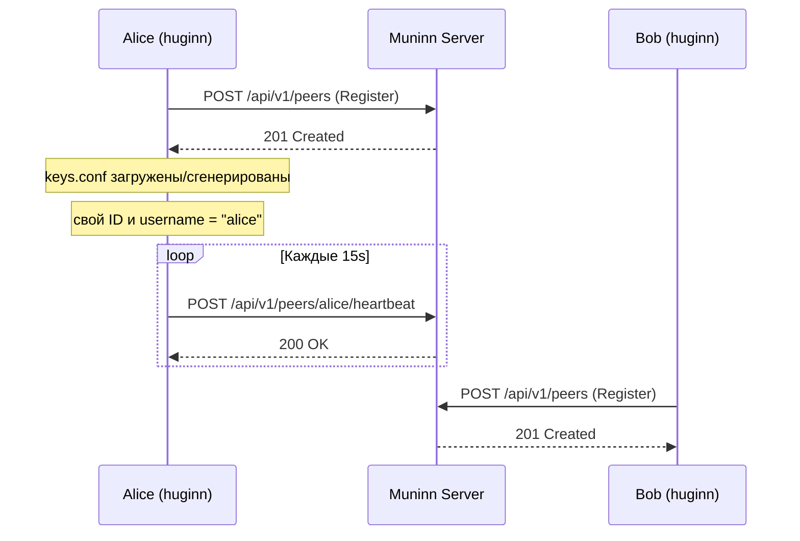
```mermaid
sequenceDiagram
    participant A as Alice (huginn)
    participant M as Muninn Server
    participant B as Bob (huginn)

    A->>M: POST /api/v1/peers (Register)
    M-->>A: 201 Created
    Note over A: keys.conf загружены/сгенерированы
    Note over A: свой ID и username = "alice"

    loop Каждые 15s
        A->>M: POST /api/v1/peers/alice/heartbeat
        M-->>A: 200 OK
    end

    B->>M: POST /api/v1/peers (Register)
    M-->>B: 201 Created
```

Каждый экземпляр Huginn при старте регистрируется на Muninn-сервере, передавая свои публичные ключи (encryption + signing), метаданные и TTL (120s). Каждые 15 секунд отправляется heartbeat, продлевающий регистрацию. Если heartbeat не пришёл вовремя — пир считается офлайн.

---

## 2. Поиск пиров

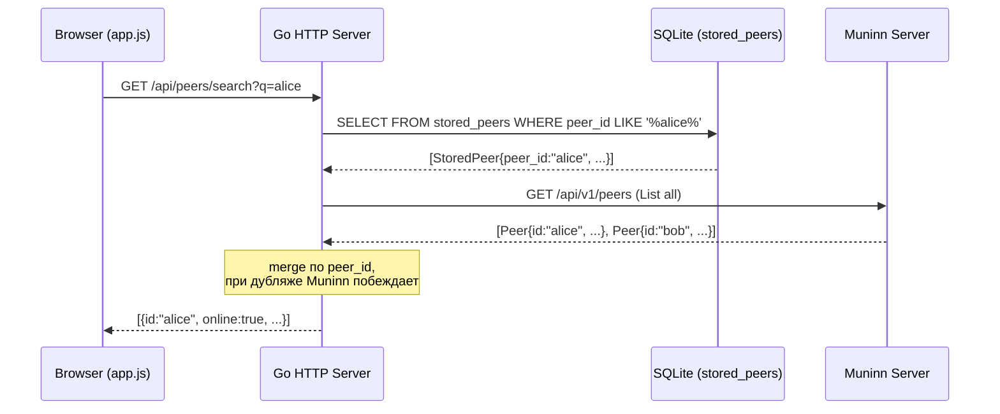
```mermaid
sequenceDiagram
    participant UI as Browser (app.js)
    participant API as Go HTTP Server
    participant DB as SQLite (stored_peers)
    participant M as Muninn Server

    UI->>API: GET /api/peers/search?q=alice
    API->>DB: SELECT FROM stored_peers WHERE peer_id LIKE '%alice%'
    DB-->>API: [StoredPeer{peer_id:"alice", ...}]
    API->>M: GET /api/v1/peers (List all)
    M-->>API: [Peer{id:"alice", ...}, Peer{id:"bob", ...}]
    Note over API: merge по peer_id,<br/>при дубляже Muninn побеждает
    API-->>UI: [{id:"alice", online:true, ...}]
```

Поиск работает в два слоя: сначала SQLite (`stored_peers` — пиры, с которыми уже было взаимодействие), затем Muninn (все зарегистрированные пиры). Результаты мержатся по `peer_id`.

---

## 3. WebRTC Signaling (установка P2P-канала)

WebRTC-соединение устанавливается через сигнальный обмен offer/answer. Есть два механизма: новый — через постоянное WebRTC-соединение с Muninn (рекомендуемый), и старый — через HTTP polling (fallback).

### 3a. WebRTC-to-Muninn (новый, основной)

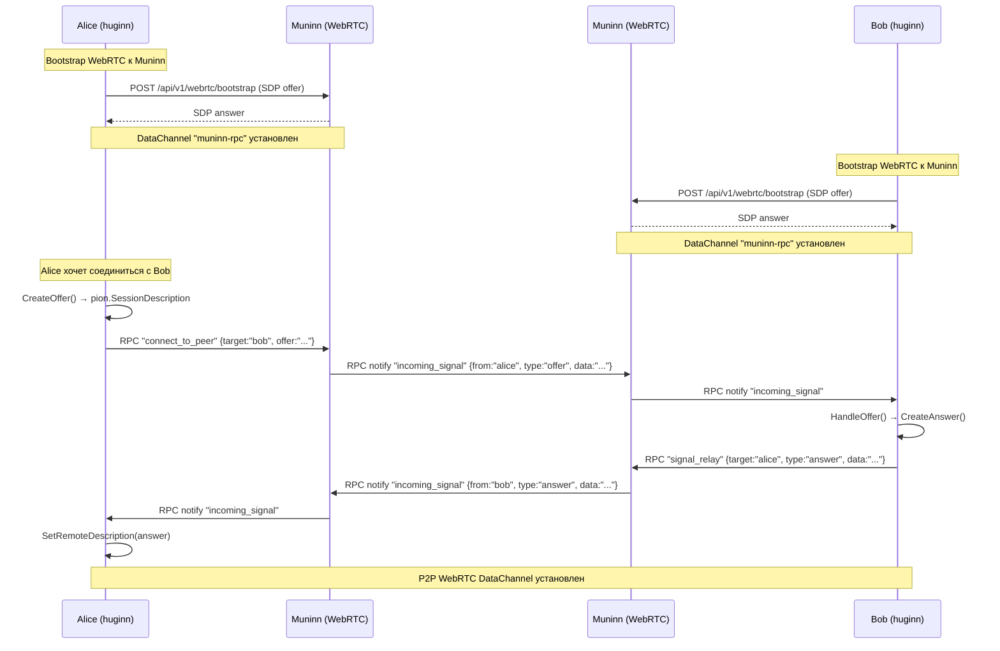
```mermaid
sequenceDiagram
    participant A as Alice (huginn)
    participant MA as Muninn (WebRTC)
    participant MB as Muninn (WebRTC)
    participant B as Bob (huginn)

    Note over A: Bootstrap WebRTC к Muninn
    A->>MA: POST /api/v1/webrtc/bootstrap (SDP offer)
    MA-->>A: SDP answer
    Note over A,MA: DataChannel "muninn-rpc" установлен

    Note over B: Bootstrap WebRTC к Muninn
    B->>MB: POST /api/v1/webrtc/bootstrap (SDP offer)
    MB-->>B: SDP answer
    Note over B,MB: DataChannel "muninn-rpc" установлен

    Note over A: Alice хочет соединиться с Bob
    A->>A: CreateOffer() → pion.SessionDescription
    A->>MA: RPC "connect_to_peer" {target:"bob", offer:"..."}
    MA->>MB: RPC notify "incoming_signal" {from:"alice", type:"offer", data:"..."}
    MB->>B: RPC notify "incoming_signal"
    B->>B: HandleOffer() → CreateAnswer()
    B->>MB: RPC "signal_relay" {target:"alice", type:"answer", data:"..."}
    MB->>MA: RPC notify "incoming_signal" {from:"bob", type:"answer", data:"..."}
    MA->>A: RPC notify "incoming_signal"
    A->>A: SetRemoteDescription(answer)
    Note over A,B: P2P WebRTC DataChannel установлен
```

Клиент при старте устанавливает постоянное WebRTC-соединение с сервером Muninn (bootstrap через одноразовый HTTP-запрос). Все последующие сигналы обмена offer/answer передаются мгновенно через это соединение в виде RPC-сообщений, без HTTP polling.

### 3b. HTTP Polling (старый, fallback)

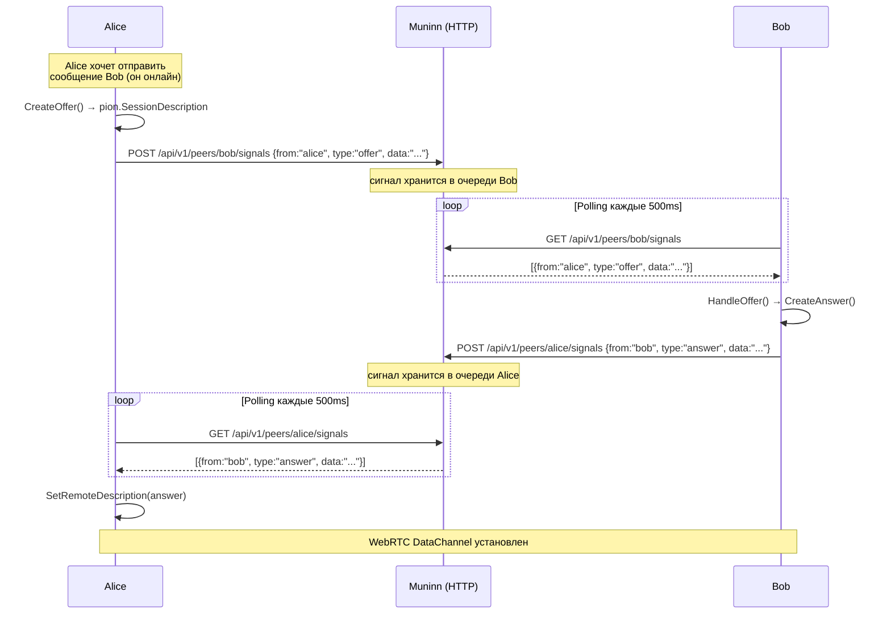
```mermaid
sequenceDiagram
    participant A as Alice
    participant M as Muninn (HTTP)
    participant B as Bob

    Note over A: Alice хочет отправить<br/>сообщение Bob (он онлайн)
    A->>A: CreateOffer() → pion.SessionDescription
    A->>M: POST /api/v1/peers/bob/signals {from:"alice", type:"offer", data:"..."}
    Note over M: сигнал хранится в очереди Bob
    loop Polling каждые 500ms
        B->>M: GET /api/v1/peers/bob/signals
        M-->>B: [{from:"alice", type:"offer", data:"..."}]
    end
    B->>B: HandleOffer() → CreateAnswer()
    B->>M: POST /api/v1/peers/alice/signals {from:"bob", type:"answer", data:"..."}
    Note over M: сигнал хранится в очереди Alice
    loop Polling каждые 500ms
        A->>M: GET /api/v1/peers/alice/signals
        M-->>A: [{from:"bob", type:"answer", data:"..."}]
    end
    A->>A: SetRemoteDescription(answer)
    Note over A,B: WebRTC DataChannel установлен
```

Если WebRTC-соединение с Muninn недоступно, клиент автоматически переключается на HTTP polling (каждые 500ms) для обмена сигналами. Сервер Muninn при получении RPC-сигнала для пира, не подключённого через WebRTC, сохраняет сигнал в Store — пир заберёт его через HTTP.

---

## 4. Онлайн-доставка (WebRTC)

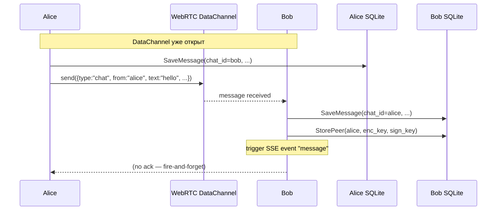
```mermaid
sequenceDiagram
    participant A as Alice
    participant DC as WebRTC DataChannel
    participant B as Bob
    participant A_DB as Alice SQLite
    participant B_DB as Bob SQLite

    Note over A,B: DataChannel уже открыт
    A->>A_DB: SaveMessage(chat_id=bob, ...)
    A->>DC: send({type:"chat", from:"alice", text:"hello", ...})
    DC-->>B: message received
    B->>B_DB: SaveMessage(chat_id=alice, ...)
    B->>B_DB: StorePeer(alice, enc_key, sign_key)
    Note over B: trigger SSE event "message"
    B-->>A: (no ack — fire-and-forget)
```

Если WebRTC-канал открыт, сообщение отправляется напрямую через DataChannel. Отправитель сохраняет сообщение у себя в БД, получатель — у себя. Никаких подтверждений доставки не предусмотрено (fire-and-forget).

---

## 5. Офлайн-доставка (Chunks)

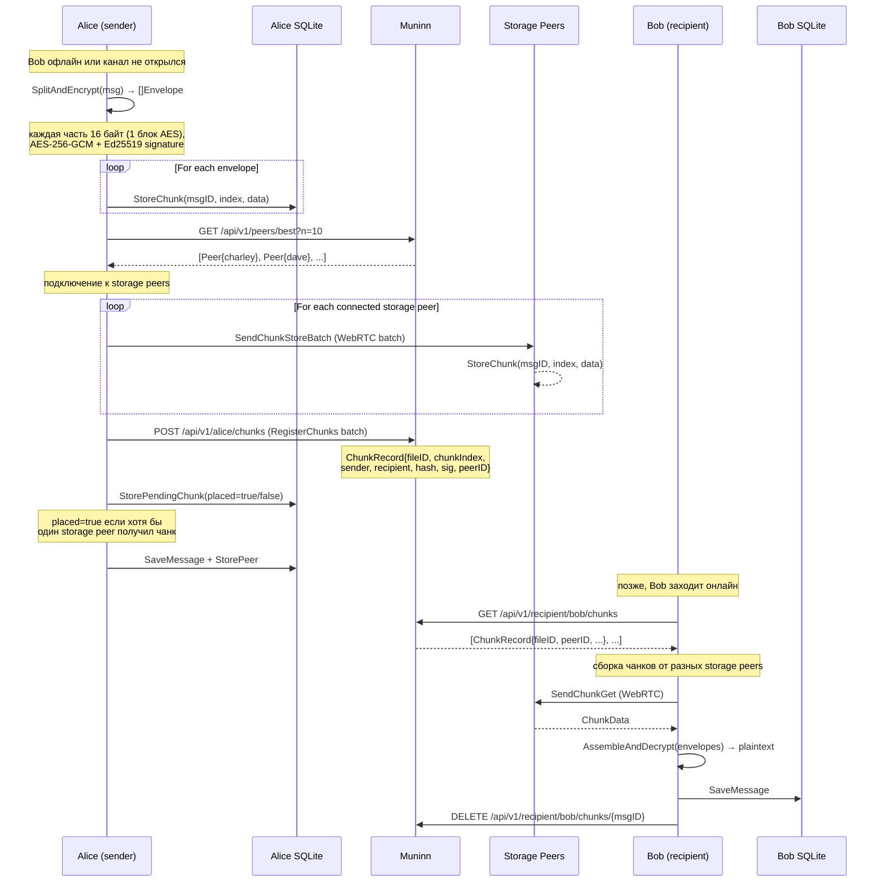
```mermaid
sequenceDiagram
    participant A as Alice (sender)
    participant A_DB as Alice SQLite
    participant M as Muninn
    participant SP as Storage Peers
    participant B as Bob (recipient)
    participant B_DB as Bob SQLite

    Note over A: Bob офлайн или канал не открылся
    A->>A: SplitAndEncrypt(msg) → []Envelope
    Note over A: каждая часть 16 байт (1 блок AES),<br/>AES-256-GCM + Ed25519 signature

    loop For each envelope
        A->>A_DB: StoreChunk(msgID, index, data)
    end

    A->>M: GET /api/v1/peers/best?n=10
    M-->>A: [Peer{charley}, Peer{dave}, ...]

    Note over A: подключение к storage peers
    loop For each connected storage peer
        A->>SP: SendChunkStoreBatch (WebRTC batch)
        SP-->>SP: StoreChunk(msgID, index, data)
    end

    A->>M: POST /api/v1/alice/chunks (RegisterChunks batch)
    Note over M: ChunkRecord{fileID, chunkIndex,<br/>sender, recipient, hash, sig, peerID}

    A->>A_DB: StorePendingChunk(placed=true/false)
    Note over A: placed=true если хотя бы<br/>один storage peer получил чанк

    A->>A_DB: SaveMessage + StorePeer

    Note over B: позже, Bob заходит онлайн
    B->>M: GET /api/v1/recipient/bob/chunks
    M-->>B: [ChunkRecord{fileID, peerID, ...}, ...]

    Note over B: сборка чанков от разных storage peers
    B->>SP: SendChunkGet (WebRTC)
    SP-->>B: ChunkData

    B->>B: AssembleAndDecrypt(envelopes) → plaintext
    B->>B_DB: SaveMessage
    B->>M: DELETE /api/v1/recipient/bob/chunks/{msgID}
```

Если P2P-канал не открылся (пир офлайн), сообщение разбивается на 1KB-зашифрованные чанки. Каждый чанк сохраняется локально и реплицируется на соседние онлайн-пиры (storage peers). Метаданные о местоположении чанков регистрируются на Muninn. Получатель периодически опрашивает Muninn о новых чанках для себя, собирает их со storage peers и дешифрует.

---

## 6. Фоновая репликация чанков

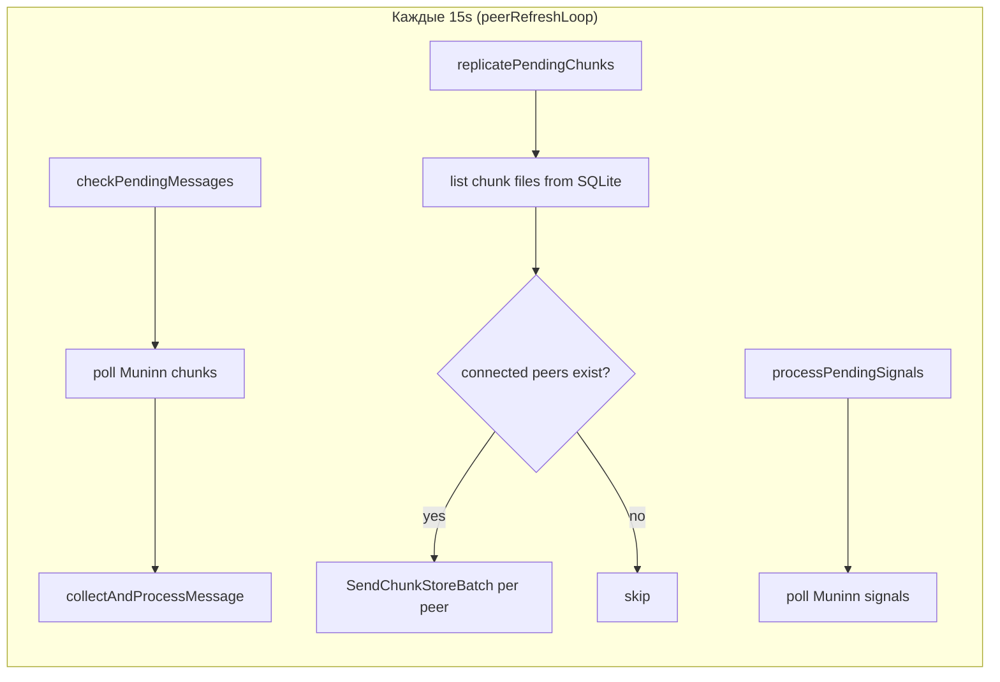
```mermaid
flowchart LR
    subgraph "Каждые 15s (peerRefreshLoop)"
        A[checkPendingMessages] --> B[poll Muninn chunks]
        B --> C[collectAndProcessMessage]

        D[replicatePendingChunks] --> E[list chunk files from SQLite]
        E --> F{connected peers exist?}
        F -->|yes| G[SendChunkStoreBatch per peer]
        F -->|no| H[skip]

        I[processPendingSignals] --> J[poll Muninn signals]
    end
```

В цикле `peerRefreshLoop` (15s) выполняются три задачи:
- **checkPendingMessages** — опрос Muninn на предмет новых чанков, адресованных нам
- **replicatePendingChunks** — распространение локально хранящихся чанков на подключённых пиров
- **processPendingSignals** — обработка WebRTC-сигналов (offer/answer)

---

## 7. Фоновая отправка неразмещённых чанков

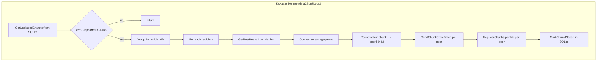
```mermaid
flowchart TB
    subgraph "Каждые 30s (pendingChunkLoop)"
        A[GetUnplacedChunks from SQLite] --> B{есть неразмещённые?}
        B -->|no| C[return]
        B -->|yes| D[Group by recipientID]

        D --> E[For each recipient]
        E --> F[GetBestPeers from Muninn]
        F --> G[Connect to storage peers]
        G --> H[Round-robin: chunk i → peer i % M]
        H --> I[SendChunkStoreBatch per peer]
        I --> J[RegisterChunks per file per peer]
        J --> K[MarkChunkPlaced in SQLite]
    end
```

Отдельная горутина `pendingChunkLoop` (30s) обрабатывает чанки, которые не удалось разместить при первой отправке (`placed=false`). Чанки группируются по получателю, затем распределяются по доступным storage peers по кругу (round-robin), отправляются батчами через WebRTC и регистрируются на Muninn.

---

## 8. Жизненный цикл pending_chunk

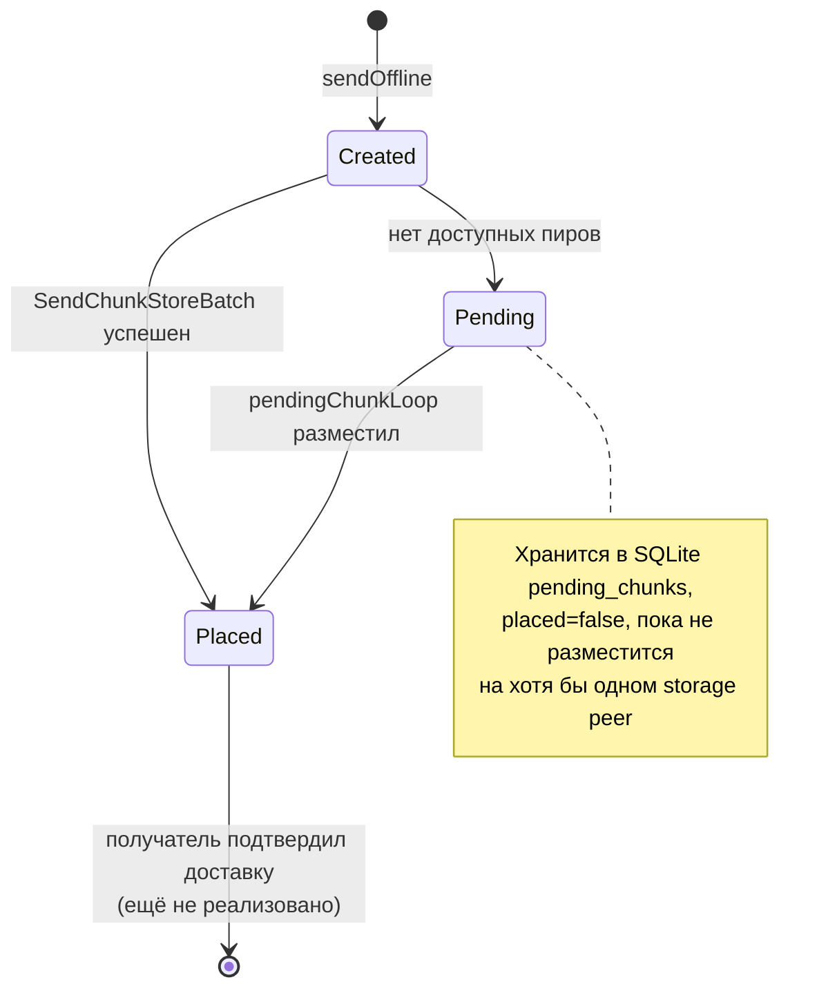
```mermaid
stateDiagram-v2
    [*] --> Created: sendOffline
    Created --> Placed: SendChunkStoreBatch успешен
    Created --> Pending: нет доступных пиров
    Pending --> Placed: pendingChunkLoop разместил
    Placed --> [*]: получатель подтвердил доставку<br/>(ещё не реализовано)

    note right of Pending
        Хранится в SQLite pending_chunks,
        placed=false, пока не разместится
        на хотя бы одном storage peer
    end note
```

Чанк создаётся в `sendOffline`. Если хотя бы один storage peer его получил — `placed=true`. Если нет — `placed=false`, и фоновый процесс будет пытаться разместить его навсегда (пока не появится механизм подтверждения доставки).

---

## 9. SSE-события (real-time UI)

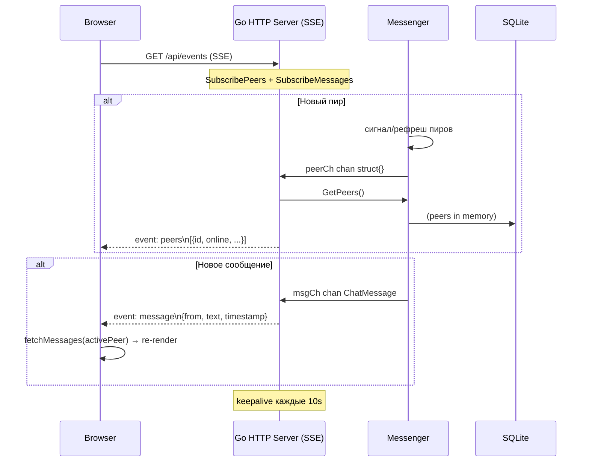
```mermaid
sequenceDiagram
    participant UI as Browser
    participant S as Go HTTP Server (SSE)
    participant M as Messenger
    participant DB as SQLite

    UI->>S: GET /api/events (SSE)
    Note over S: SubscribePeers + SubscribeMessages

    alt Новый пир
        M->>M: сигнал/рефреш пиров
        M->>S: peerCh chan struct{}
        S->>M: GetPeers()
        M->>DB: (peers in memory)
        S-->>UI: event: peers\n[{id, online, ...}]
    end

    alt Новое сообщение
        M->>S: msgCh chan ChatMessage
        S-->>UI: event: message\n{from, text, timestamp}
        UI->>UI: fetchMessages(activePeer) → re-render
    end

    Note over S: keepalive каждые 10s
```

---

## 10. Пользовательский поиск (UI → API)

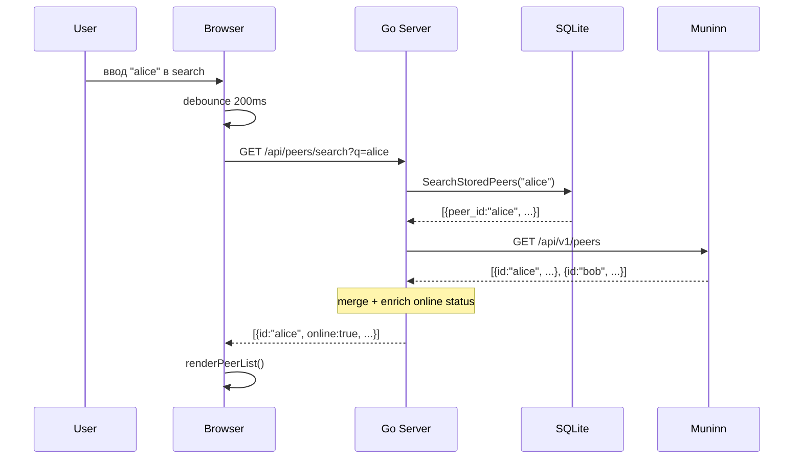
```mermaid
sequenceDiagram
    participant U as User
    participant UI as Browser
    participant API as Go Server
    participant DB as SQLite
    participant M as Muninn

    U->>UI: ввод "alice" в search
    UI->>UI: debounce 200ms
    UI->>API: GET /api/peers/search?q=alice

    API->>DB: SearchStoredPeers("alice")
    DB-->>API: [{peer_id:"alice", ...}]

    API->>M: GET /api/v1/peers
    M-->>API: [{id:"alice", ...}, {id:"bob", ...}]

    Note over API: merge + enrich online status
    API-->>UI: [{id:"alice", online:true, ...}]

    UI->>UI: renderPeerList()
```

Поиск на фронтенде с дебаунсом (200ms). При пустом запросе — возвращается полный список через стандартный `/api/peers`. При непустом — `/api/peers/search?q=...` с поиском по локальному SQLite + Muninn.

---

## 11. WebRTC RPC Protocol (клиент-серверный канал с Muninn)

Для замены HTTP polling сигналов используется постоянное WebRTC-соединение между каждым клиентом Huginn и сервером Muninn. Поверх DataChannel работает RPC-протокол.

### Bootstrap (HTTP → WebRTC)

```
POST /api/v1/webrtc/bootstrap
Headers: X-Peer-ID: <peer_id>
Body: pion.SessionDescription (SDP offer)
Response: pion.SessionDescription (SDP answer)
```

Одноразовый HTTP-запрос для начального handshake. Клиент создаёт `PeerConnection` и DataChannel `"muninn-rpc"`, отправляет SDP offer. Сервер создаёт answer. После этого всё общение идёт через WebRTC DataChannel.

### Протокол сообщений (DataChannel)

Все сообщения — JSON. Есть три типа:

**Request** (клиент → сервер):
```json
{"id": "uuid", "method": "method_name", "params": {...}}
```

**Response** (сервер → клиент):
```json
{"id": "uuid", "result": {...}, "error": ""}
```

**Notification** (сервер → клиент):
```json
{"method": "method_name", "params": {...}}
```

### RPC-методы

| Метод | Направление | Описание |
|-------|-------------|----------|
| `connect_to_peer` | client → server | Запрос на соединение с другим пиром. Server проверяет, подключён ли target через WebRTC; если да — шлёт notification, если нет — сохраняет сигнал в Store |
| `signal_relay` | client → server | Релей сигнала (offer/answer) целевому пиру |
| `incoming_signal` | server → client (notify) | Входящий сигнал от другого пира |

### Параметры методов

**connect_to_peer:**
```json
{"target_id": "bob", "offer": "SDP_offer_string"}
```

**signal_relay:**
```json
{"target_id": "bob", "from": "alice", "type": "answer", "data": "SDP_answer_string"}
```

**incoming_signal (notification):**
```json
{"from": "alice", "type": "offer", "data": "SDP_offer_string"}
```

### Обработка на сервере (Muninn)

Сервер (`internal/webrtc/handler.go`) поддерживает `map[string]*peerConn` — активные WebRTC-подключения пиров.

При получении `connect_to_peer` или `signal_relay`:
1. Проверить, есть ли target в `peers` (подключён через WebRTC)
2. Если да — отправить notification напрямую через DataChannel target'а
3. Если нет — сохранить сигнал в `store.Store.SetSignal()`, откуда target заберёт его через HTTP polling

При отключении пира — автоматический cleanup из map.

### Клиентская часть (Huginn)

Клиент (`internal/muninn/rtc.go` → `WSClient`):
- Управляет `PeerConnection` к Muninn
- Отправляет RPC-запросы и сопоставляет ответы по UUID
- Принимает notification'ы через колбэк `OnSignal`
- Автоматический reconnect при обрыве (каждые 5s, в `rtcReconnectLoop`)
- Fallback на HTTP polling, если WebRTC недоступен

---

## Сводка протоколов обмена

| Сценарий | Протокол | Частота | Размер данных |
|----------|----------|---------|---------------|
| Регистрация | HTTP REST (Muninn) | При старте | ~500 bytes |
| Heartbeat | HTTP REST (Muninn) | Каждые 15s | ~50 bytes |
| Пинг сигналов | **WebRTC RPC** (Muninn DataChannel) | Push (мгновенно) | ~100 bytes |
| Пинг сигналов (fallback) | HTTP REST (Muninn) | Каждые 500ms | ~100 bytes |
| Bootstrap WebRTC-to-Muninn | HTTP REST (однократно) | При старте | ~2-5KB |
| Поиск пиров | HTTP REST (Muninn) | По запросу | зависит от N пиров |
| WebRTC Offer/Answer | **WebRTC RPC** (Muninn DataChannel) | Однократно при коннекте | ~2-5KB |
| WebRTC Offer/Answer (fallback) | HTTP REST (Muninn signals) | Однократно при коннекте | ~2-5KB |
| Онлайн-сообщение | WebRTC DataChannel (P2P) | Однократно | произвольный |
| Офлайн-чанк | WebRTC DataChannel (batch) | ~ раз в 30s | ~1KB × N чанков |
| Регистрация чанков | HTTP REST (Muninn, batch) | При отправке | ~200 bytes × N |
| Репликация чанков | WebRTC DataChannel (batch) | Каждые 15s | ~1KB × N |
| SSE события | HTTP Server-Sent Events | Постоянно | ~1-5KB |
| Поиск пользователей | HTTP REST (local API) | При вводе | ~100-500 bytes |

---

## 12. Групповые чаты (Group Chats)

### 12.1. Модель группы

Групповой чат — это виртуальный пир на Muninn. Каждая группа имеет:

- **UID** — UUID, используется как `peer_id` на сервере
- **Name** — человекочитаемое имя группы
- **Encryption keys** — пара X25519 (EncPrivate/EncPublic) для шифрования сообщений группы
- **Signing keys** — пара Ed25519 (SignPrivate/SignPublic) для подписи сообщений группы

Группа регистрируется на Muninn с флагом `PeerFlag = "very_thick"` и TTL 86400s (24h). В отличие от обычных пиров, группа **не отправляет heartbeat** — её регистрация обновляется только явным вызовом `groupHeartbeatLoop`.

```go
// internal/messenger/messenger.go:1484-1496
req := &muninn.RegisterRequest{
    ID:            uid,
    Keys:          []muninn.Key{{Login: name, Signature: "huginn-v1"}},
    EncryptionKey: gc.EncPublic,
    SignatureKey:  gc.SignPublic,
    Metadata:      map[string]string{"username": name, "type": "huginn-group"},
    TTLSeconds:    86400,
    PeerFlag:      muninn.PeerFlag("very_thick"),
}
```

### 12.2. Создание группы

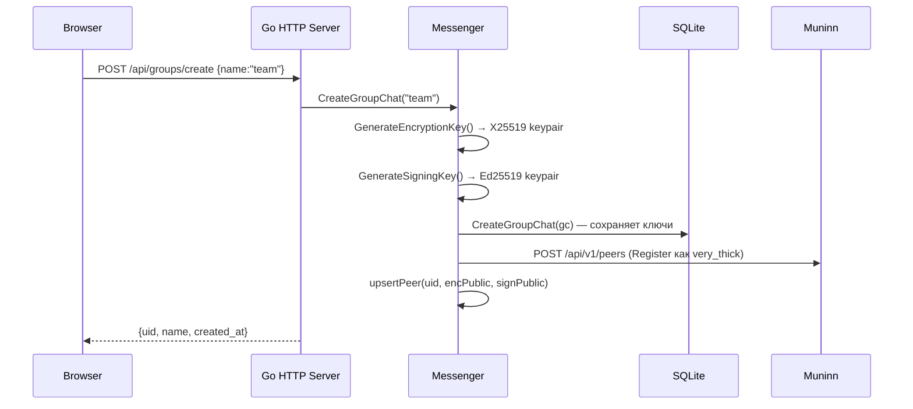
```mermaid
sequenceDiagram
    participant UI as Browser
    participant API as Go HTTP Server
    participant M as Messenger
    participant DB as SQLite
    participant Mu as Muninn

    UI->>API: POST /api/groups/create {name:"team"}
    API->>M: CreateGroupChat("team")
    M->>M: GenerateEncryptionKey() → X25519 keypair
    M->>M: GenerateSigningKey() → Ed25519 keypair
    M->>DB: CreateGroupChat(gc) — сохраняет ключи
    M->>Mu: POST /api/v1/peers (Register как very_thick)
    M->>M: upsertPeer(uid, encPublic, signPublic)
    API-->>UI: {uid, name, created_at}
```

Ключи группы генерируются на стороне создателя. Закрытые ключи хранятся **только на клиенте создателя** и никуда не отправляются. Чтобы добавить участника, создатель отправляет инвайт (см. 12.3).

### 12.3. Приглашение в группу (Invite)

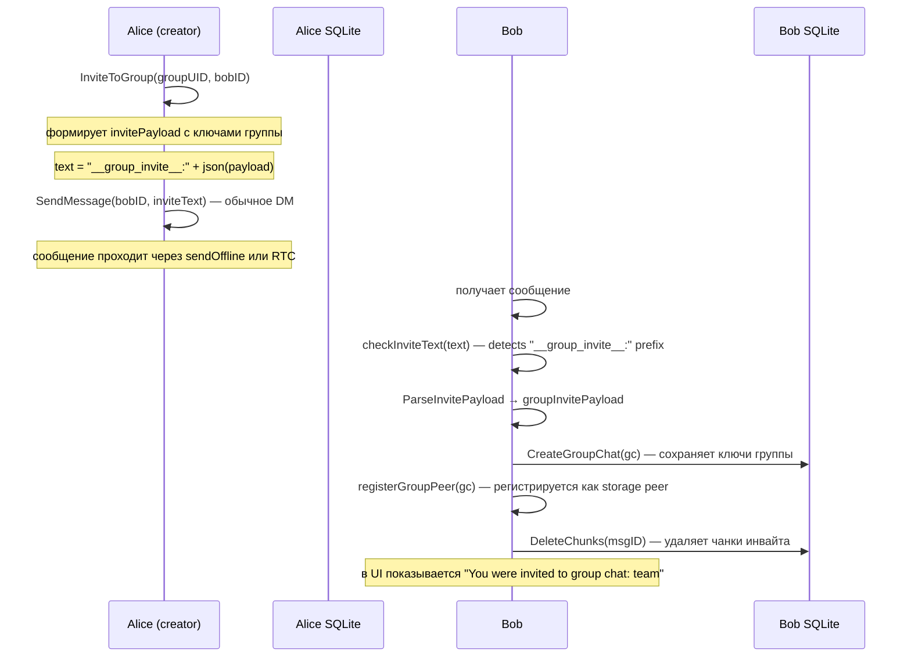
```mermaid
sequenceDiagram
    participant A as Alice (creator)
    participant A_DB as Alice SQLite
    participant B as Bob
    participant B_DB as Bob SQLite

    A->>A: InviteToGroup(groupUID, bobID)
    Note over A: формирует invitePayload с ключами группы
    Note over A: text = "__group_invite__:" + json(payload)
    A->>A: SendMessage(bobID, inviteText) — обычное DM
    Note over A: сообщение проходит через sendOffline или RTC
    B->>B: получает сообщение
    B->>B: checkInviteText(text) — detects "__group_invite__:" prefix
    B->>B: ParseInvitePayload → groupInvitePayload
    B->>B_DB: CreateGroupChat(gc) — сохраняет ключи группы
    B->>B: registerGroupPeer(gc) — регистрируется как storage peer
    B->>B_DB: DeleteChunks(msgID) — удаляет чанки инвайта
    Note over B: в UI показывается "You were invited to group chat: team"
```

Механизм инвайта работает через обычное DM-сообщение с префиксом `__group_invite__:`. Отправитель сериализует все ключи группы (включая закрытые) в JSON и отправляет их как обычный текст. Получатель детектит префикс в `checkInviteText()`, парсит payload и сохраняет группу в свою БД. После этого он регистрируется как storage peer для этой группы (см. 12.5).

**Payload инвайта:**
```json
{
  "uid": "group-uuid",
  "name": "team",
  "enc_private": "base64...",
  "enc_public": "base64...",
  "sign_private": "base64...",
  "sign_public": "base64..."
}
```

### 12.4. Отправка сообщения в группу

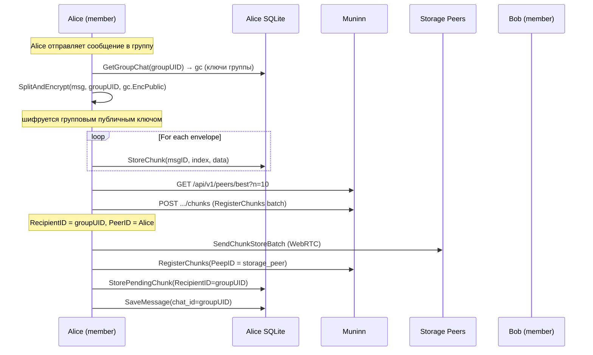
```mermaid
sequenceDiagram
    participant A as Alice (member)
    participant A_DB as Alice SQLite
    participant M as Muninn
    participant SP as Storage Peers
    participant B as Bob (member)

    Note over A: Alice отправляет сообщение в группу
    A->>A_DB: GetGroupChat(groupUID) → gc (ключи группы)
    A->>A: SplitAndEncrypt(msg, groupUID, gc.EncPublic)
    Note over A: шифруется групповым публичным ключом

    loop For each envelope
        A->>A_DB: StoreChunk(msgID, index, data)
    end

    A->>M: GET /api/v1/peers/best?n=10
    A->>M: POST .../chunks (RegisterChunks batch)
    Note over A: RecipientID = groupUID, PeerID = Alice

    A->>SP: SendChunkStoreBatch (WebRTC)
    A->>M: RegisterChunks(PеерID = storage_peer)

    A->>A_DB: StorePendingChunk(RecipientID=groupUID)
    A->>A_DB: SaveMessage(chat_id=groupUID)
```

Ключевое отличие от DM:
- **RecipientID** = groupUID (не ID пользователя)
- **Encryption** = групповым публичным ключом (любой участник может расшифровать своим закрытым)
- **TTL** = 604800 (1 неделя), фиксированный
- Файлы не поддерживаются (files=nil)

### 12.5. Получение сообщения из группы

Каждый участник группы регистрируется как storage peer для этой группы:

```go
// registerGroupPeer — вызывается при старте и после получения инвайта
func (m *Messenger) registerGroupPeer(gc *store.GroupChat) {
    // регистрирует себя (m.ID) как storage peer для groupUID на Muninn
    m.muninnClient.RegisterAsPeer(m.ctx, groupUID, m.ID)
}
```

Это гарантирует, что при опросе чанков для группы Muninn вернёт и этого участника как владельца чанков.

Получение:

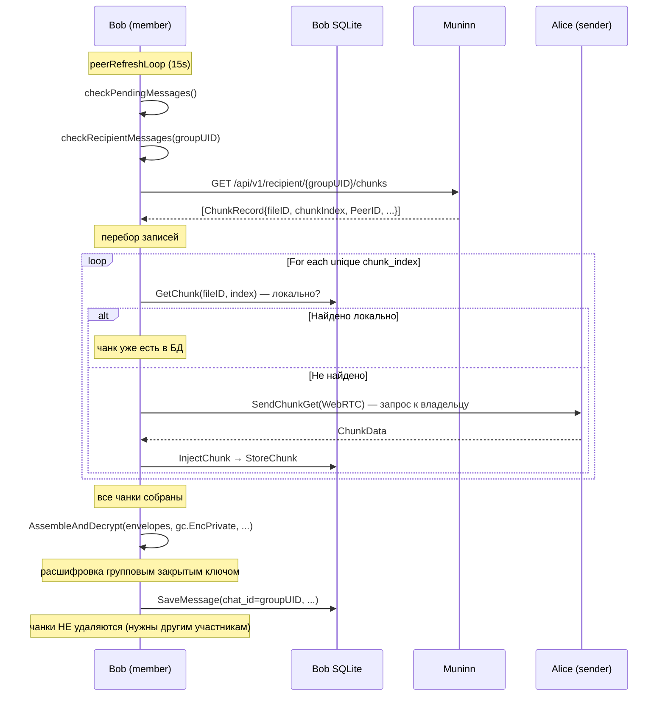
```mermaid
sequenceDiagram
    participant B as Bob (member)
    participant B_DB as Bob SQLite
    participant M as Muninn
    participant A as Alice (sender)

    Note over B: peerRefreshLoop (15s)
    B->>B: checkPendingMessages()
    B->>B: checkRecipientMessages(groupUID)
    B->>M: GET /api/v1/recipient/{groupUID}/chunks
    M-->>B: [ChunkRecord{fileID, chunkIndex, PeerID, ...}]

    Note over B: перебор записей
    loop For each unique chunk_index
        B->>B_DB: GetChunk(fileID, index) — локально?
        alt Найдено локально
            Note over B: чанк уже есть в БД
        else Не найдено
            B->>A: SendChunkGet(WebRTC) — запрос к владельцу
            A-->>B: ChunkData
            B->>B_DB: InjectChunk → StoreChunk
        end
    end

    Note over B: все чанки собраны
    B->>B: AssembleAndDecrypt(envelopes, gc.EncPrivate, ...)
    Note over B: расшифровка групповым закрытым ключом
    B->>B_DB: SaveMessage(chat_id=groupUID, ...)
    Note over B: чанки НЕ удаляются (нужны другим участникам)
```

Критическое отличие от DM: чанки **не удаляются** после успешной расшифровки (см. `collectAndProcessMessage`, строка 1400), так как они нужны другим участникам группы, которые ещё не получили сообщение.

### 12.6. Жизненный цикл группового сообщения

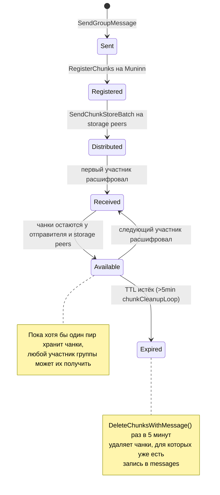
```mermaid
stateDiagram-v2
    [*] --> Sent: SendGroupMessage
    Sent --> Registered: RegisterChunks на Muninn
    Registered --> Distributed: SendChunkStoreBatch на storage peers
    Distributed --> Received: первый участник расшифровал
    Received --> Available: чанки остаются у отправителя и storage peers
    Available --> Received: следующий участник расшифровал
    Available --> Expired: TTL истёк (>5min chunkCleanupLoop)

    note right of Available
        Пока хотя бы один пир хранит чанки,
        любой участник группы может их получить
    end note

    note right of Expired
        DeleteChunksWithMessage() раз в 5 минут
        удаляет чанки, для которых уже есть
        запись в messages
    end note
```

Отправитель и storage peers хранят чанки до истечения TTL или до очистки `chunkCleanupLoop` (каждые 5 минут, `DeleteChunksWithMessage` удаляет чанки, уже сохранённые в `messages`). Это создаёт окно доставки: если участник группы не зайдёт онлайн в течение ~5 минут, он может не успеть скачать чанки.

### 12.7. Group Heartbeat Loop

Группы не отправляют heartbeat сами по себе (нет своей горутины heartbeat). Вместо этого каждый участник в `groupHeartbeatLoop` обновляет регистрацию групп, участником которых он является:

```go
func (m *Messenger) groupHeartbeatLoop() {
    ticker := time.NewTicker(5 * time.Minute)
    for {
        select {
        case <-ticker.C:
            groups, _ := m.store.GetGroupChats()
            for _, g := range groups {
                m.muninnClient.Register(m.ctx, registerReq)
            }
        }
    }
}
```

### 12.8. API (C-bridge)

Для интеграции с UI (C API) доступны четыре функции:

| Функция | Описание |
|---------|----------|
| `messenger_create_group` | Создать группу: `(name) → {uid, name}` |
| `messenger_get_groups` | Получить список групп: `() → [{uid, name}]` |
| `messenger_invite_to_group` | Пригласить пользователя: `(groupUID, peerID) → error` |
| `messenger_send_group_message` | Отправить сообщение: `(groupUID, text) → error` |

### 12.9. UI Flow

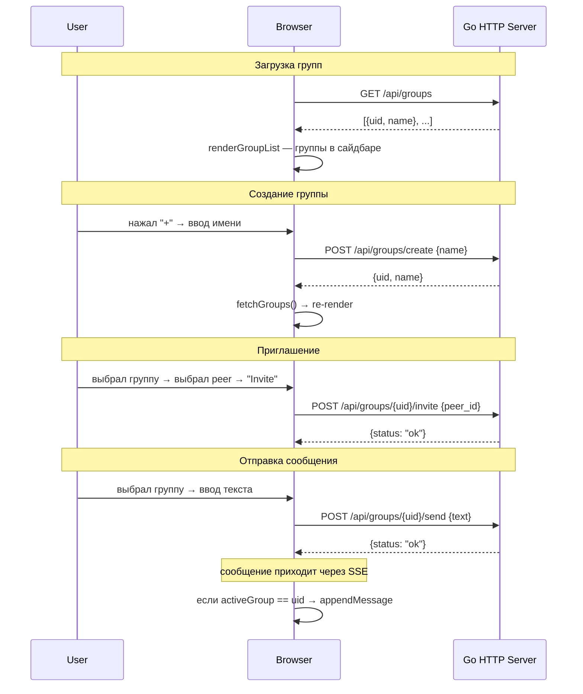
```mermaid
sequenceDiagram
    participant U as User
    participant UI as Browser
    participant API as Go HTTP Server

    Note over U,API: Загрузка групп
    UI->>API: GET /api/groups
    API-->>UI: [{uid, name}, ...]
    UI->>UI: renderGroupList — группы в сайдбаре

    Note over U,API: Создание группы
    U->>UI: нажал "+" → ввод имени
    UI->>API: POST /api/groups/create {name}
    API-->>UI: {uid, name}
    UI->>UI: fetchGroups() → re-render

    Note over U,API: Приглашение
    U->>UI: выбрал группу → выбрал peer → "Invite"
    UI->>API: POST /api/groups/{uid}/invite {peer_id}
    API-->>UI: {status: "ok"}

    Note over U,API: Отправка сообщения
    U->>UI: выбрал группу → ввод текста
    UI->>API: POST /api/groups/{uid}/send {text}
    API-->>UI: {status: "ok"}
    Note over UI: сообщение приходит через SSE
    UI->>UI: если activeGroup == uid → appendMessage
```

UI отображает группы в отдельной секции сайдбара. При выборе группы открывается окно чата, идентичное DM, но с дополнительной кнопкой "Invite" для приглашения участников.

---

## 13. Relogin (перенос идентичности)

### 13.1. Назначение

Relogin копирует с одного устройства на другое идентичность и локальное состояние пользователя: ключи, историю сообщений, direct-контакты и групповые чаты. После relogin целевой пир получает те же ключи шифрования и подписи, что и пир-источник, и может выступать от его имени.

Локальные пути и содержимое файлов в снимок не входят. Для каждого вложения передаются только метаданные (`file_id`, hash, ключ расшифровки, число чанков, имя и peer ID исходного устройства). Целевое устройство сохраняет такой указатель и загружает чанки в фоне с исходного устройства или storage-пиров.

### 13.2. Схема работы

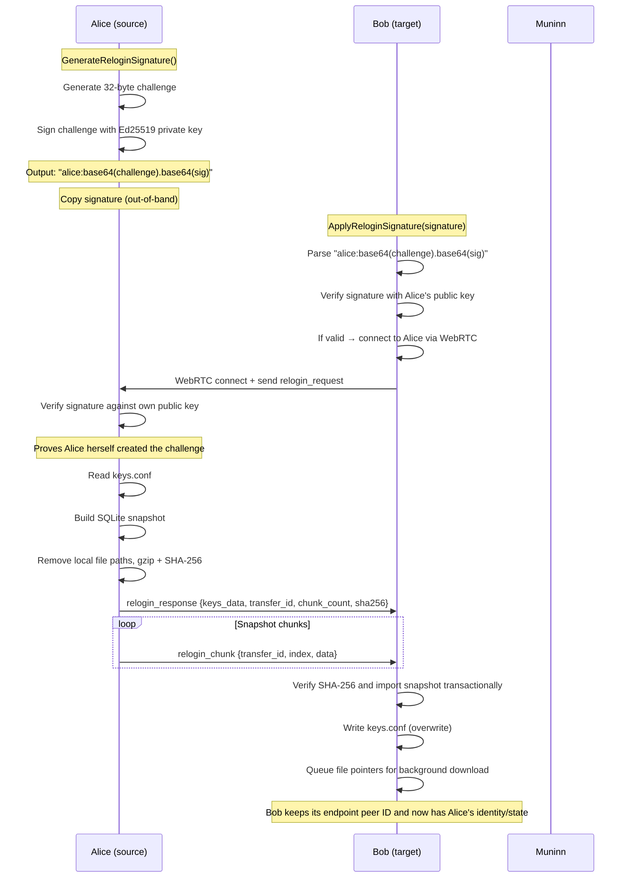
```mermaid
sequenceDiagram
    participant A as Alice (source)
    participant B as Bob (target)
    participant M as Muninn

    Note over A: GenerateReloginSignature()
    A->>A: Generate 32-byte challenge
    A->>A: Sign challenge with Ed25519 private key
    Note over A: Output: "alice:base64(challenge).base64(sig)"

    Note over A: Copy signature (out-of-band)

    Note over B: ApplyReloginSignature(signature)
    B->>B: Parse "alice:base64(challenge).base64(sig)"
    B->>B: Verify signature with Alice's public key
    B->>B: If valid → connect to Alice via WebRTC
    B->>A: WebRTC connect + send relogin_request

    A->>A: Verify signature against own public key
    Note over A: Proves Alice herself created the challenge
    A->>A: Read keys.conf
    A->>A: Build SQLite snapshot
    A->>A: Remove local file paths, gzip + SHA-256
    A->>B: relogin_response {keys_data, transfer_id, chunk_count, sha256}
    loop Snapshot chunks
        A->>B: relogin_chunk {transfer_id, index, data}
    end

    B->>B: Verify SHA-256 and import snapshot transactionally
    B->>B: Write keys.conf (overwrite)
    B->>B: Queue file pointers for background download
    Note over B: Bob keeps its endpoint peer ID and now has Alice's identity/state
```

### 13.3. Формат подписи

```
peerID:base64(challenge).base64(signature)
```

- `peerID` — ID пира, к которому нужно подключиться (Alice)
- `challenge` — 32 случайных байта
- `signature` — Ed25519-подпись `challenge`, созданная приватным ключом Alice

### 13.4. Проверка подписи

При получении `relogin_request` сторона-источник (Alice) извлекает challenge из подписи и верифицирует его своим собственным публичным ключом:

```go
crypto.Verify(m.signPublic, challenge, sig) // true только если подпись создана m.signPrivate
```

Поскольку только Alice знает свой приватный ключ, только она могла создать данную подпись. Если подпись валидна — значит, Alice сама сгенерировала этот challenge, и Bob действует с её разрешения.

Сторона-цель (Bob) также верифицирует подпись перед подключением к Alice — это подтверждает, что signature была создана именно Alice.

### 13.5. Передача ключей и данных

После верификации подписи Alice читает `keys.conf`, строит согласованный снимок таблиц `messages`, `stored_peers` и `group_chats`, удаляет из сообщений локальные `file_path`, затем сжимает снимок gzip. Канал WebRTC уже защищён DTLS-шифрованием, дополнительное шифрование не требуется.

Сжатый снимок разбивается на сообщения размером не более 32 KiB. Bob собирает их по `transfer_id`, проверяет SHA-256 и импортирует снимок одной SQLite-транзакцией. Импорт идемпотентно объединяет записи по их первичным ключам и не удаляет локальные записи целевого устройства. Только после успешного импорта Bob сохраняет новые ключи и конфигурацию.

Физический `peer_id` Bob не заменяется на `peer_id` Alice: устройства остаются отдельными WebRTC endpoints с одной пользовательской криптографической идентичностью. Это также позволяет Bob после пересоздания Go-инстанса продолжить фоновую загрузку файлов непосредственно с Alice.

### 13.6. Протокол WebRTC

Типы сообщений relogin в `internal/webrtc/webrtc.go`:

| Тип | Направление | Структура |
|-----|-------------|-----------|
| `relogin_request` | Bob → Alice | `{signature: "alice:challenge.sig"}` |
| `relogin_response` | Alice → Bob | `{keys_data, transfer_id, chunk_count, sha256, error?}` |
| `relogin_chunk` | Alice → Bob | `{transfer_id, index, data}` |

### 13.7. C-bridge API

| Функция | Описание |
|---------|----------|
| `messenger_generate_relogin_signature` | Сгенерировать подпись: `() → {signature}` |
| `messenger_apply_relogin_signature` | Применить подпись: `(signature) → {status}` |

### 13.8. Важные замечания

- **Relogin не требует хранения состояния.** Alice не запоминает созданные challenge'и — верификация подписи доказывает, что она сама её создала.
- **После relogin старые ключи Bob'а теряются.** Если Bob не сохранил их отдельно, он не сможет восстановить свою старую идентичность.
- **Endpoint peer ID не меняется.** Relogin меняет пользовательский login и криптографические ключи, но сохраняет уникальный ID устройства.
- **После relogin Flutter пересоздаёт Go-инстанс.** Новый экземпляр регистрируется на Muninn с прежним endpoint `peer_id`, новым login/ключами и возобновляет фоновые загрузки по сохранённым файловым указателям.
